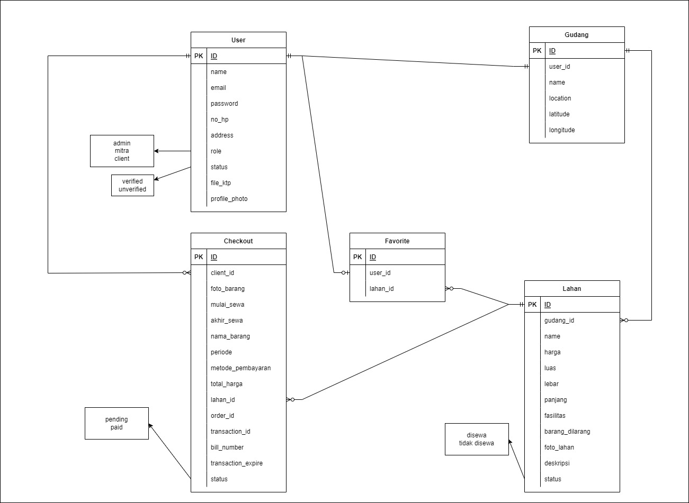

  <h1 align="center">WAREHOUSE APP</h1>

## Table of Contents
1. [About](#about-the-project)
2. [High Level Architecture](#high-level-architecture)
3. [Entity Relationship Diagram](#entity-relationship-diagram)
4. [Features](#features)
5. [Tech Stack](#tech-stack)
6. [Business Layer](#business-layer)
7. [Unit Test](#unit-test)
8. [Collaborator](#collaborator)

## About The Project
Warehouse App is an application for goods storage service providers. All items can be stored through the Warehouse Application, from the smallest to the largest. This service is a solution to problems that occur in dealing with shortages of storage space, such as entrepreneurs who want to store SME(Small and medium-sized enterprises) merchandise so that they can be easily accessed from their place of business. And people who have more unused land can also register to become a Warehouse App partner. For all user roles in this application are as follows:
- Admin : user who act as admin of Warehouse-App
- Partner : user who act as warehouse provider
- Client : user who act as warehouse tenant

(<a href="#top">back to top</a>)

## High Level Architecture

(<a href="#top">back to top</a>)

## Entity Relationship Diagram

(<a href="#top">back to top</a>)

## Features
Some features in this project using JWT Token. This token is obtained when logging in. To find out the complete documentation of each feature, please check the provided <a href="https://app.swaggerhub.com/apis-docs/muhdwiar/WarehouseCapstoneProject/1.0.0#/">Swagger</a>. The available features are as follows:

### :adult: User
| Endpoint | Feature | Description | Token | 
| --- | --- | --- | --- |
| /register | POST | User register to make account | :x: |
| /login | POST | Login for user, as admin, patner, or client | :x: |
| /mitra/unverify | GET | Admin sees unverified partner list  | :heavy_check_mark: |
| /mitra/verified | GET | Admin sees verified partner list | :heavy_check_mark: |
| /mitra/verify/:id | PUT | Admin verifies partner who has registered | :heavy_check_mark: |
| /mitra/:id | GET | Admin sees partner details | :heavy_check_mark: |
| /mitra/:id | Delete | Admin delete partner account | :heavy_check_mark: |
| /mitra | GET | Partner sees his/her profile and warehouse data | :heavy_check_mark: |
| /mitra | PUT | Partner update his/her profile or password | :heavy_check_mark: |
| /penitip | GET | Client sees his/her profile | :heavy_check_mark: |
| /penitip | PUT | Client update his/her profile or password | :heavy_check_mark: |
| /penitip | Delete | Client delete his/her account | :heavy_check_mark: |

### :house_with_garden: Warehouse
| Endpoint | Feature | Description | Token | 
| --- | --- | --- | --- |
| /gudang | POST | Partner add his/her warehouse | :heavy_check_mark: |
| /gudang | PUT | Partner update his/her warehouse data | :heavy_check_mark: |
| /gudang | GET | Client sees all warehouses data | :heavy_check_mark: |
| /gudang/:id | GET | Patner or Client sees area data of the warehouse | :heavy_check_mark: |

### :derelict_house: Warehouse Area
| Endpoint | Feature | Description | Token | 
| --- | --- | --- | --- |
| /lahan | POST | Partner add his/her warehouse-area | :heavy_check_mark: |
| /lahan/:id | PUT | Partner update his/her warehouse-area data | :heavy_check_mark: |
| /lahan/:id | DELETE | Partner delete his/her warehouse-area data | :heavy_check_mark: |
| /lahan/:id | GET | Client or Partner sees warehouse-area data | :heavy_check_mark: |
| /penitip/lahan | GET | Client sees all warehouse-area data where the goods are stored | :heavy_check_mark: |

### :sparkling_heart: Favorite
| Endpoint | Feature | Description | Token | 
| --- | --- | --- | --- |
| /favorite | POST | Client add his/her favorite warehouse-area | :heavy_check_mark: |
| /favorite | GET | Client see his/hers favorite warehouse-area list | :heavy_check_mark: |
| /favorite/:id | DELETE | Client delete his/her favorite warehouse-area data | :heavy_check_mark: |

### :dollar: Checkout
| Endpoint | Feature | Description | Token | 
| --- | --- | --- | --- |
| /order | POST | Client order a warehouse-area | :heavy_check_mark: |

(<a href="#top">back to top</a>)

## Tech Stack

(<a href="#top">back to top</a>)

## Business Layer

(<a href="#top">back to top</a>)

## Unit Test
Coverage results from each use case layer:

(<a href="#top">back to top</a>)

## Collaborator
* Dian Nurdiana ~ [Github](https://github.com/diannd) ~ [LinkedIn](linkedin.com/in/dian-nurdiana-85589923b)
* Muhamad Dwi Arifianto ~ [Github](https://github.com/muhdwiar) ~ [LinkedIn](https://www.linkedin.com/in/muhamad-dwi-arifianto-b76147238/)

(<a href="#top">back to top</a>)

